# SAP Expense Tracker & Analytics Dashboard (ABAP Cloud + OData V4)

A full-stack Expense Tracker and Analytics Dashboard built using SAP ABAP Cloud, CDS Views, OData V4 Services, SAP S/4HANA 2023, and a modern frontend application developed using Antigravity.

---

## Project Overview

This project demonstrates end-to-end SAP application development using the ABAP RESTful programming model and OData V4 services.

The application allows users to:

- Manage expense records
- Categorize expenses
- Track spending trends
- Analyze expense distributions
- Consume SAP OData services through a modern UI
- Integrate SAP backend data with a frontend dashboard

---

## Repository Structure

```text
SAP-Expense-Tracker-ABAP-Cloud
│
├── README.md
├── Screenshots/
│   ├── Dashboard.png
│   ├── expenses.png
│   ├── add_expense_modal.png
│   ├── settings.png
│   ├── zi_expense_cds.png
│   ├── service_definition.png
│   ├── service_binding.png
│   ├── zcategory_master_structure.png
│   ├── zexpense_tracker_structure.png
│   ├── zuser_master_table.png
│   ├── sap_gui_category_master_data.png
│   ├── sap_gui_expense_tracker_data.png
│   ├── sap_gui_zcategory_master_structure.png
│   └── sap_gui_zexpense_tracker_structure.png
│
└── Source_Code/
    ├── Tables/
    ├── CDS_Views/
    ├── OData_Services/
    ├── Documentation/
    └── Reports/
```

---

## System Architecture

```text
Frontend Application
        │
        ▼
OData V4 Service
        │
        ▼
Service Binding
        │
        ▼
Service Definition
        │
        ▼
CDS View
        │
        ▼
ABAP Database Tables
```

---

## Technologies Used

### SAP Backend

- SAP S/4HANA 2023
- SAP ABAP Cloud
- Core Data Services (CDS)
- OData V4 Services
- Service Definitions
- Service Bindings
- SAP GUI
- Eclipse ADT

### Frontend

- Antigravity
- TypeScript
- Modern Dashboard UI
- REST/OData Integration

---

## Source Code Organization

### Tables

Contains custom SAP database tables:

- ZCATEGORY_MASTER
- ZUSER_MASTER
- ZEXPENSE_TRACKER

### CDS Views

Contains CDS artifacts used for data modeling and OData exposure:

- ZI_EXPENSE_CDS

### OData Services

Contains service layer objects:

- ZUI_EXPENSE_SRV
- ZUI_EXPENSE_BIND

### Documentation

Contains architecture and implementation notes.

### Reports

Reserved for future analytical and reporting programs.

---

## Database Design

### User Master Table

Stores user information.

Fields:

- USER_ID
- USER_NAME
- EMAIL
- PHONE
- CREATED_ON

---

### Category Master Table

Stores expense categories.

Fields:

- CATEGORY_ID
- CATEGORY_NAME

Examples:

- FOOD
- SHOPPING
- TRAVEL
- BILLS

---

### Expense Tracker Table

Stores expense transactions.

Fields:

- EXPENSE_ID
- USER_ID
- CATEGORY_ID
- AMOUNT
- DESCRIPTION
- EXPENSE_DATE

---

## CDS View

The CDS View exposes expense data for OData consumption and reporting.

Entity:

```abap
ZI_EXPENSE_CDS
```

Features:

- Semantic data modeling
- UI annotations
- OData exposure
- Analytics-ready structure

---

## OData Service

### Service Definition

```abap
ZUI_EXPENSE_SRV
```

Exposes:

```abap
ZI_EXPENSE_CDS
```

---

### Service Binding

```abap
ZUI_EXPENSE_BIND
```

Binding Type:

```text
OData V4 - UI
```

Used for frontend integration.

---

# Application Screenshots

## Dashboard

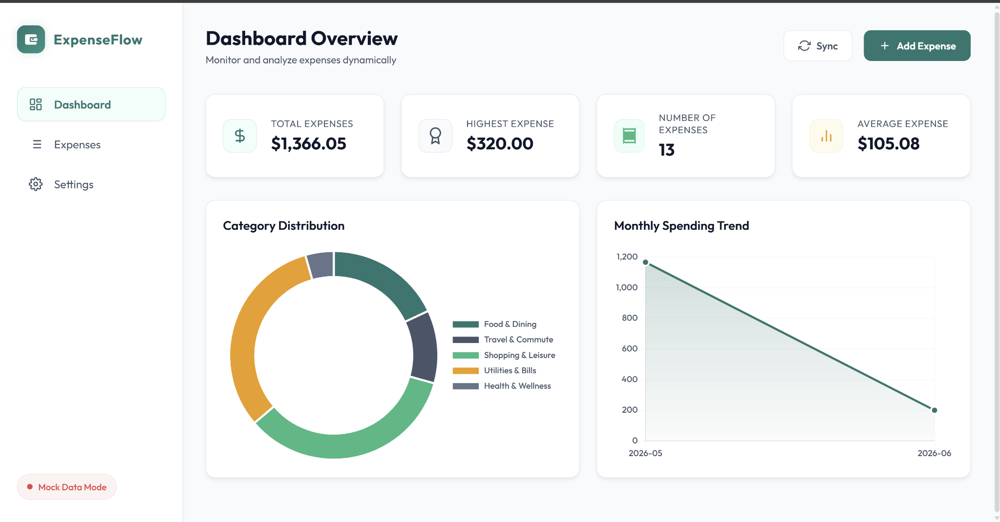

Displays:

- Total Expenses
- Highest Expense
- Expense Count
- Average Expense
- Category Distribution
- Monthly Trends

---

## Expense Ledger

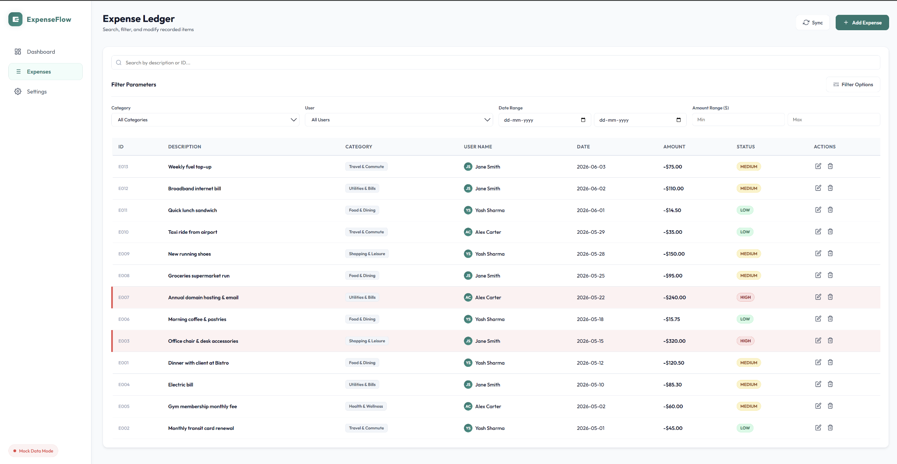

Features:

- Search
- Filters
- Expense Records
- CRUD Operations

---

## Add Expense

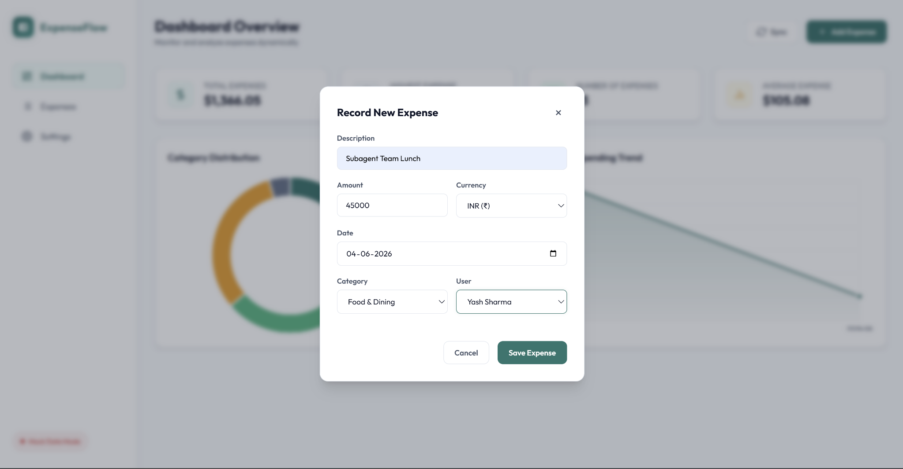

Supports:

- Expense Creation
- Category Selection
- User Selection
- Date Selection
- Currency Selection

---

## Configuration Screen

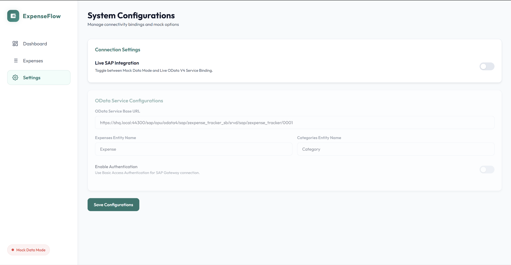

Allows configuration of:

- OData Service URL
- Entity Names
- Authentication
- SAP Integration Settings

---

# SAP Backend Screenshots

## CDS View

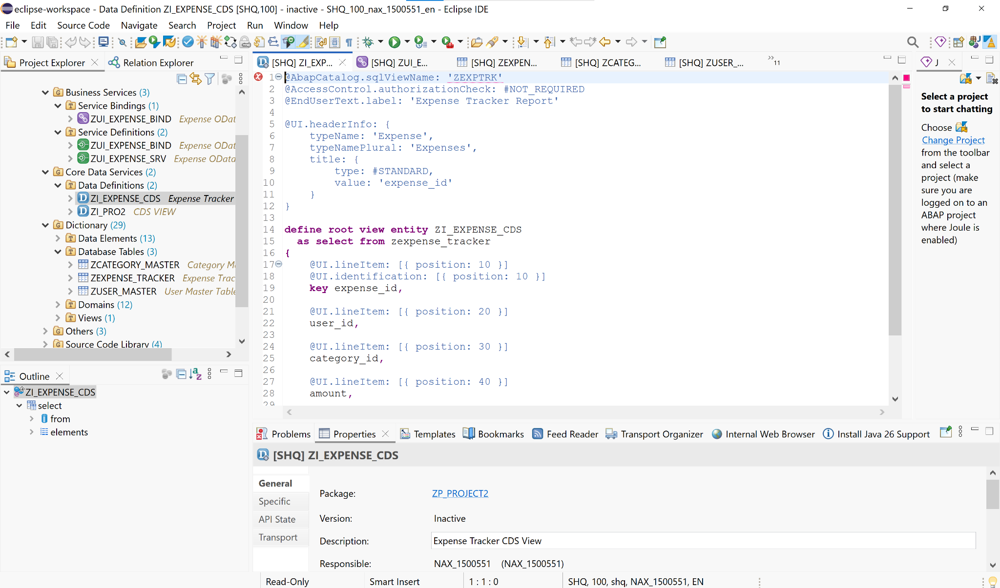

---

## Service Definition

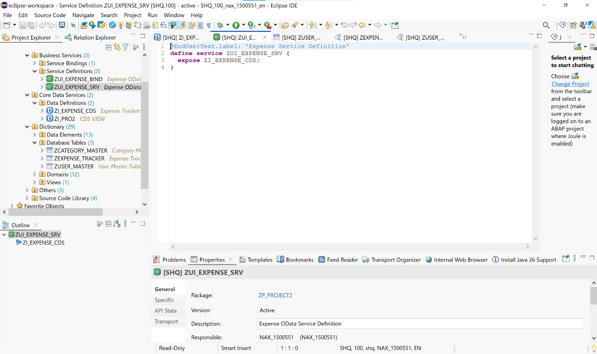

---

## Service Binding

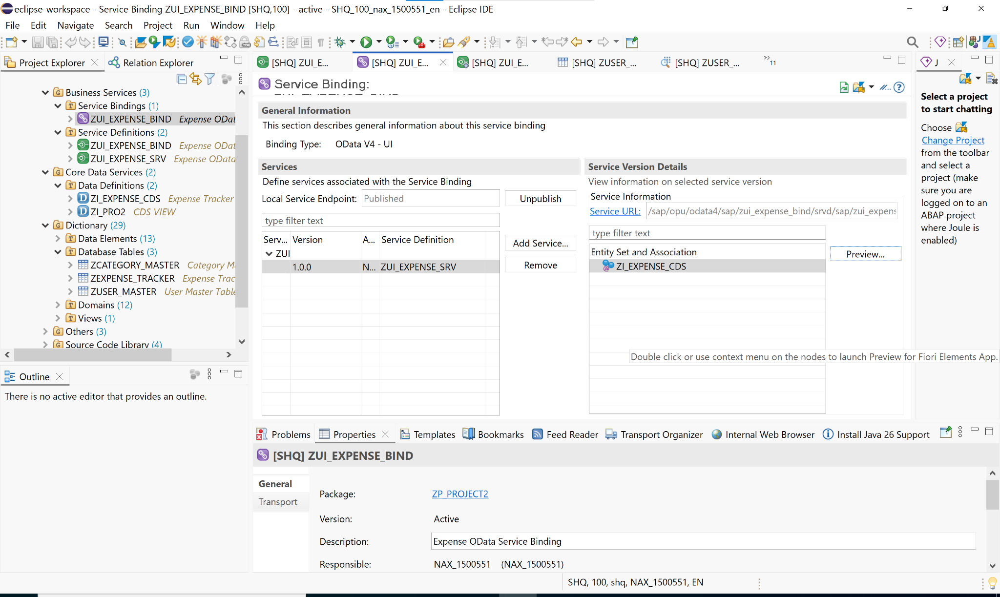

---

## Category Table Structure

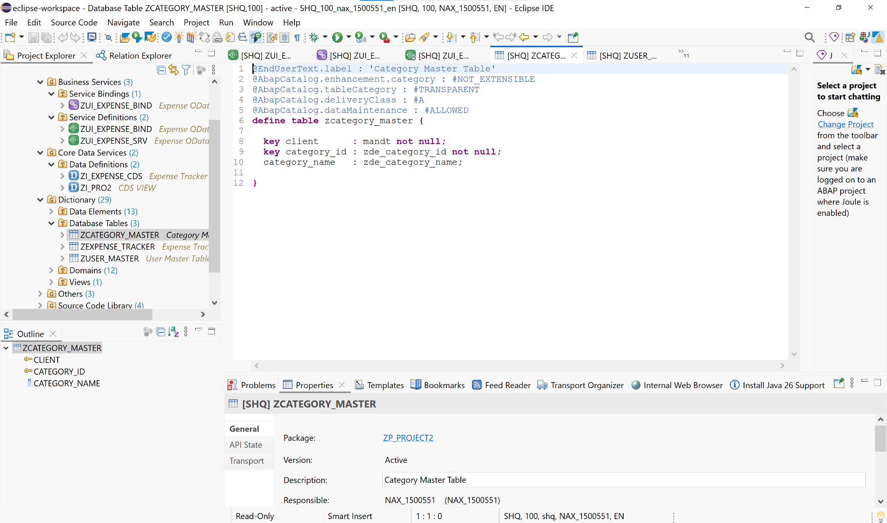

---

## Expense Table Structure

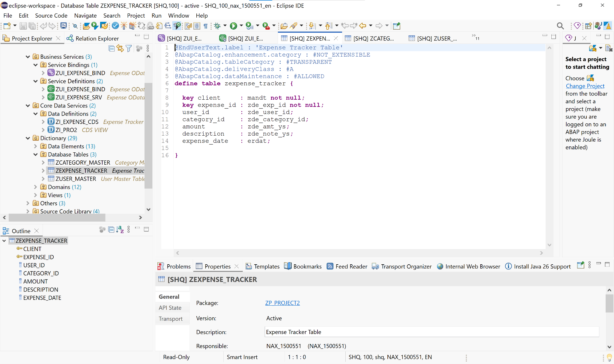

---

## User Table Structure

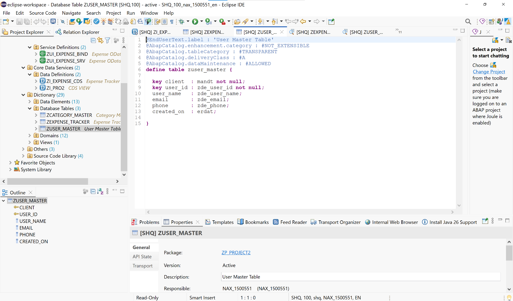

---

# SAP GUI Validation

## Category Master Data

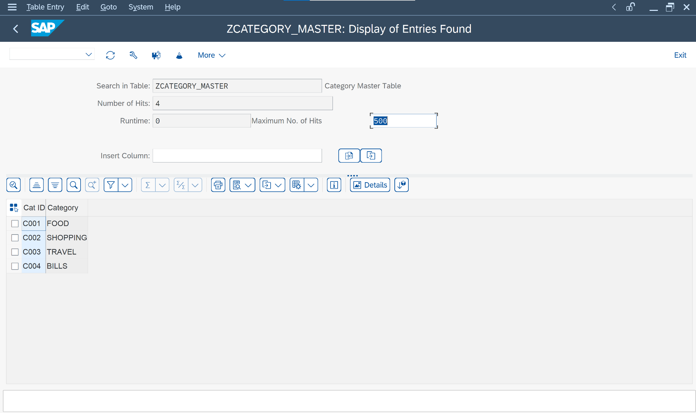

---

## Expense Tracker Data

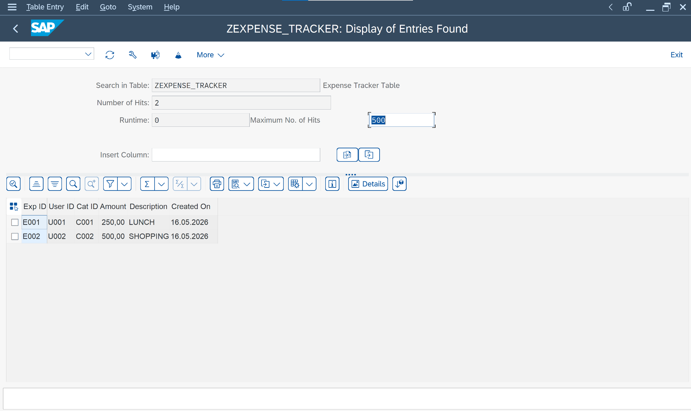

---

## Category Table Structure

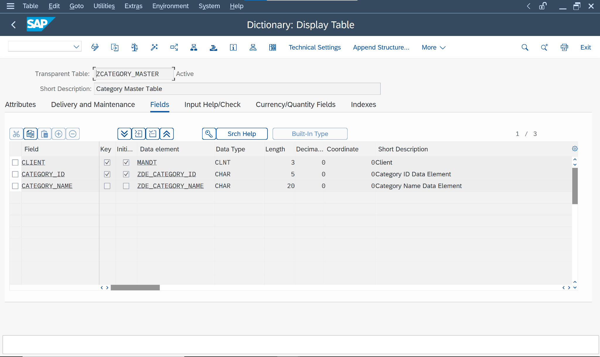

---

## Expense Table Structure

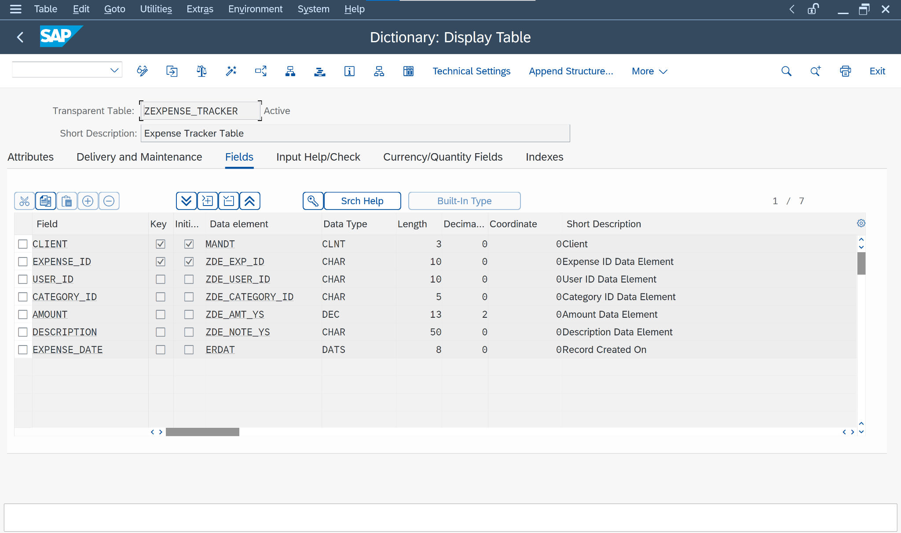

---

## Key Features

- SAP ABAP Cloud Development
- CDS-Based Data Modeling
- OData V4 Service Exposure
- SAP GUI Validation
- Eclipse ADT Development
- Frontend Dashboard Integration
- Expense Analytics Dashboard
- Category Management
- CRUD-Based Expense Tracking
- Full-Stack SAP Application Architecture
- End-to-End SAP Backend to Frontend Connectivity

---

## Future Enhancements

- User Authentication & Authorization
- RAP-Based Business Object Implementation
- Fiori Elements Integration
- Expense Approval Workflow
- Real-Time Analytics
- Budget Tracking Module
- Export to Excel/PDF
- Mobile Responsive SAP Fiori UI

---

## Author

### Yashashri Penikalapati

B.Tech – Information Technology  
MLR Institute of Technology  
Hyderabad, India

### Project Highlights

✔ SAP ABAP Cloud Development  
✔ SAP S/4HANA 2023  
✔ CDS View Modeling  
✔ OData V4 Service Development  
✔ Eclipse ADT Development  
✔ SAP GUI Data Validation  
✔ Frontend Integration using Antigravity  
✔ Full-Stack SAP Application Architecture

---

## License

This project is intended for educational, learning, and portfolio purposes.
